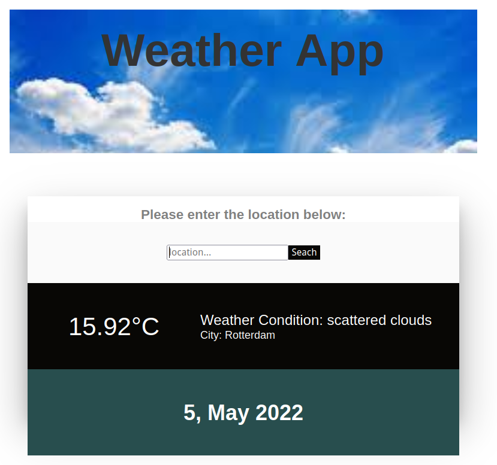

# weather app
Weather app which calls the openweathermap.org api to retreive the current weather based on the provided location.



## Build and Run
Container can be built with:
```
podman build -t ghcr.io/amreshh/weather:0.0.1 .
```

Run the container (exposing port 3000)
```
podman run -p 3000:3000 ghcr.io/amreshh/weather:0.0.1
```

# References
- https://openweathermap.org/api